# TieDye项目系统设计报告

## 1. 项目概述

TieDye是一个基于Unity引擎的扎染可视化设计应用程序，围绕扎染艺术的完整生态系统构建。该应用不仅允许用户创建、编辑和预览扎染图案（模拟扎染模块），还包含历史文化展示、工艺技术介绍、成品展示和纹样介绍等多个功能场景。通过交互式图文介绍，用户可以全面了解扎染艺术的历史、工艺、纹样特点和现代应用。

## 2. 项目架构设计

### 2.1 系统架构图

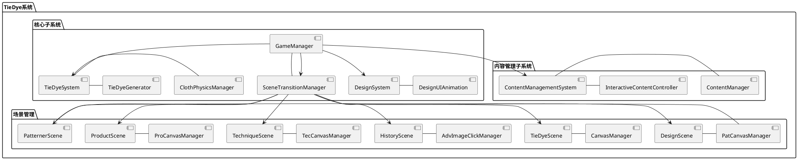

### 2.2 分层架构

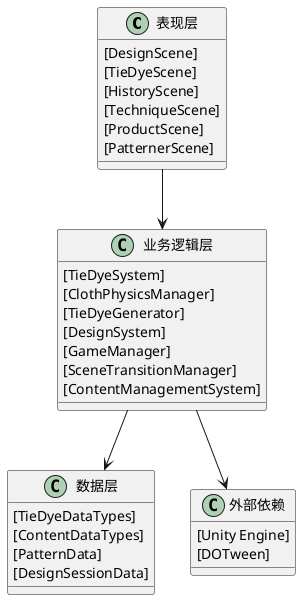

## 3. 场景设计

### 3.1 场景关系图

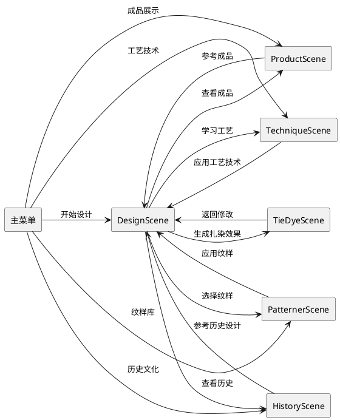

### 3.2 核心场景设计

#### 3.2.1 DesignScene（图案设计场景）

**功能描述**：用户进行扎染图案设计的主要场景，支持图案的添加、拖拽、缩放、旋转和删除。

**主要组件**：
- 图案选择面板：左侧垂直排列的图案按钮
- 设计画布：中央的扎染图案设计区域
- 模式切换按钮：拖拽、缩放、旋转模式切换
- 下一步按钮：进入扎染效果预览场景

**UI交互流程**：
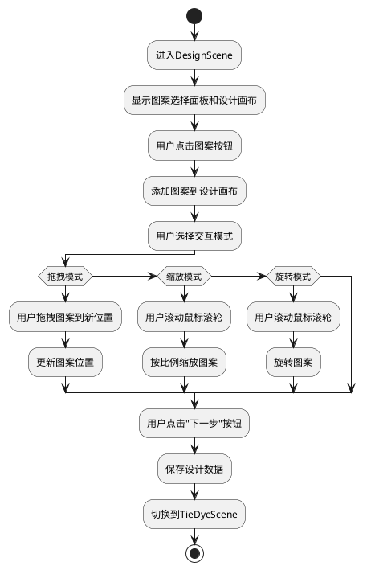

#### 3.2.2 TieDyeScene（扎染效果预览场景）

**功能描述**：展示生成的扎染纹理和布料物理效果，支持参数调整。

**主要组件**：
- 布料展示区：中央的3D布料模型
- 参数控制面板：调整颜色渗透、布料纹理等参数
- 返回按钮：返回设计场景修改

**UI交互流程**：
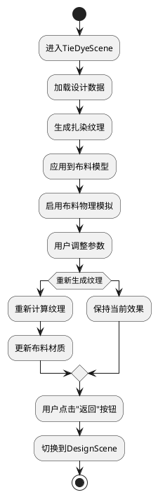

#### 3.2.3 HistoryScene（历史文化展示场景）

**功能描述**：展示扎染历史文化的图文内容，支持时间线浏览和事件查看。

**主要组件**：
- 时间线：展示历史事件的时间轴
- 内容展示区：显示选中事件的详细内容
- 导航按钮：返回主菜单或跳转到其他场景

**UI交互流程**：
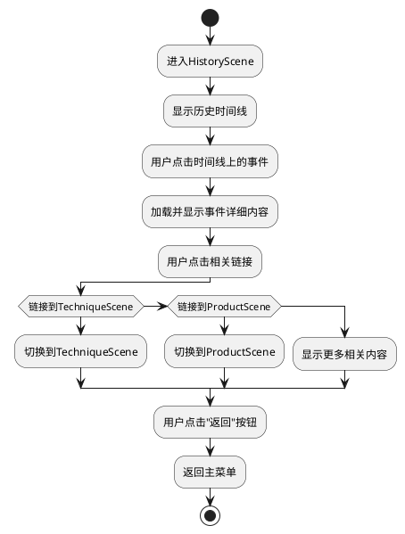

#### 3.2.4 TechniqueScene（工艺技术介绍场景）

**功能描述**：介绍扎染工艺技术，包括步骤演示和工具说明。

**主要组件**：
- 工艺步骤列表：垂直排列的工艺步骤
- 内容展示区：显示选中步骤的详细说明
- 模拟操作按钮：演示工艺操作

**UI交互流程**：
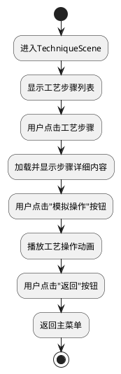

#### 3.2.5 ProductScene（成品展示场景）

**功能描述**：展示扎染成品案例，支持分类浏览和详情查看。

**主要组件**：
- 产品分类菜单：顶部的分类标签
- 产品展示区：网格布局的产品缩略图
- 详情展示区：显示选中产品的详细信息

**UI交互流程**：
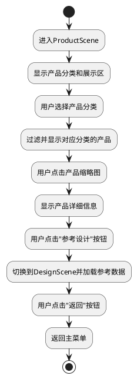

#### 3.2.6 PatternerScene（纹样库场景）

**功能描述**：展示各种扎染纹样，支持选择和应用到设计中。

**主要组件**：
- 纹样分类面板：左侧的纹样分类
- 纹样展示区：网格布局的纹样缩略图
- 详情面板：显示选中纹样的详细信息

**UI交互流程**：
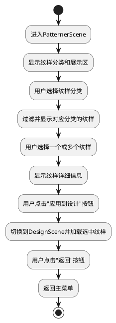

## 4. 类设计

### 4.1 核心类关系图

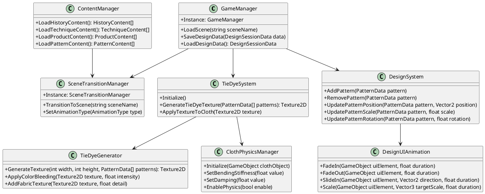

### 4.2 关键类设计

#### 4.2.1 GameManager（游戏管理器）

**类说明**：实现单例模式，负责整体游戏状态管理、场景加载和数据存储。

**核心属性**：
- `Instance`: GameManager的单例实例
- `currentDesignData`: 当前的设计会话数据

**核心方法**：
- `LoadScene(string sceneName)`: 加载指定场景
- `SaveDesignData(DesignSessionData data)`: 保存设计数据
- `LoadDesignData()`: 加载设计数据

#### 4.2.2 SceneTransitionManager（场景过渡管理器）

**类说明**：实现单例模式，负责场景之间的平滑过渡动画。

**核心属性**：
- `Instance`: SceneTransitionManager的单例实例
- `transitionCanvas`: 过渡动画画布
- `animationType`: 当前使用的动画类型

**核心方法**：
- `TransitionToScene(string sceneName)`: 过渡到指定场景
- `SetAnimationType(AnimationType type)`: 设置过渡动画类型
- `PlayFadeAnimation()`: 播放淡入淡出动画
- `PlaySlideAnimation()`: 播放滑动动画

#### 4.2.3 TieDyeGenerator（扎染生成器）

**类说明**：负责根据设计数据生成扎染纹理。

**核心属性**：
- `textureWidth`: 纹理宽度
- `textureHeight`: 纹理高度
- `colorMixing`: 颜色混合强度
- `colorBleeding`: 颜色渗透强度

**核心方法**：
- `GenerateTexture(int width, int height, PatternData[] patterns)`: 生成扎染纹理
- `ApplyColorBleeding(Texture2D texture, float intensity)`: 应用颜色渗透效果
- `AddFabricTexture(Texture2D texture, float detail)`: 添加布料纹理细节

#### 4.2.4 ClothPhysicsManager（布料物理管理器）

**类说明**：负责控制布料的物理属性和模拟效果。

**核心属性**：
- `clothComponent`: Unity布料组件
- `bendingStiffness`: 弯曲刚度
- `damping`: 阻尼系数
- `useGravity`: 是否使用重力

**核心方法**：
- `Initialize(GameObject clothObject)`: 初始化布料物理
- `SetBendingStiffness(float value)`: 设置弯曲刚度
- `SetDamping(float value)`: 设置阻尼系数
- `EnablePhysics(bool enable)`: 启用/禁用物理模拟

#### 4.2.5 DesignSystem（设计系统）

**类说明**：负责管理扎染图案的设计过程。

**核心属性**：
- `patterns`: 当前设计中的图案列表
- `selectedPattern`: 当前选中的图案
- `currentMode`: 当前的交互模式

**核心方法**：
- `AddPattern(PatternData pattern)`: 添加图案
- `RemovePattern(PatternData pattern)`: 删除图案
- `UpdatePatternPosition(PatternData pattern, Vector2 position)`: 更新图案位置
- `UpdatePatternScale(PatternData pattern, float scale)`: 更新图案缩放
- `UpdatePatternRotation(PatternData pattern, float rotation)`: 更新图案旋转

## 5. 交互设计

### 5.1 UI交互流程图

```plantuml
@startuml
!define RECTANGLE rectangle
!define ARROW -->

RECTANGLE "用户操作" {
    :点击UI元素;
    :拖拽UI元素;
    :缩放UI元素;
    :旋转UI元素;
    :滚动鼠标;
    :键盘输入;
}

RECTANGLE "事件处理" {
    :IPointerClickHandler
    :IDragHandler
    :IScrollHandler
    :IEndDragHandler
}

RECTANGLE "动画效果" {
    :淡入淡出
    :滑动
    :缩放
    :旋转
    :颜色变化
}

RECTANGLE "业务逻辑" {
    :更新数据
    :状态切换
    :场景跳转
    :效果生成
}

"用户操作" ARROW "事件处理"
"事件处理" ARROW "动画效果"
"事件处理" ARROW "业务逻辑"
"动画效果" ARROW "业务逻辑"
@enduml
```

### 5.2 主要交互模式

#### 5.2.1 多场景导航交互

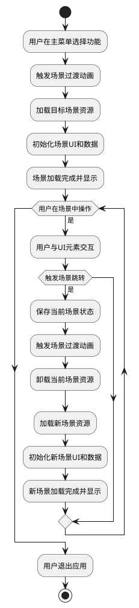

#### 5.2.2 图案设计交互

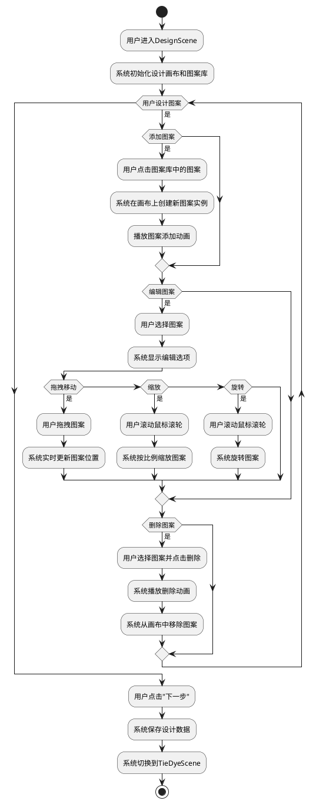

## 6. 美工设计

### 6.1 视觉风格

TieDye项目采用了传统与现代相结合的视觉风格，主要特点包括：

1. **色彩方案**：
   - 主色调：靛蓝色（#1A365D）- 代表传统扎染的经典颜色
   - 辅助色：红色（#E53E3E）、黄色（#D69E2E）、绿色（#38A169）- 代表扎染的丰富色彩
   - 中性色：白色（#FFFFFF）、浅灰色（#F7FAFC）、深灰色（#2D3748）- 用于UI背景和文字

2. **排版**：
   - 标题字体：思源黑体 Bold
   - 正文字体：思源黑体 Regular
   - 强调文字：思源黑体 Medium
   - 字号层级：标题（24px）、副标题（20px）、正文（16px）、辅助文字（14px）

3. **图形元素**：
   - 传统扎染纹样作为装饰元素
   - 简洁的几何图形用于UI控件
   - 柔和的渐变效果增强视觉层次感

### 6.2 界面布局

```plantuml
@startuml
!define RECTANGLE rectangle
!define ARROW -->

left to right direction

RECTANGLE "顶部导航栏" {
    :Logo
    :标题
    :返回按钮
}

RECTANGLE "左侧面板" {
    :分类菜单
    :功能按钮
    :导航链接
}

RECTANGLE "中央内容区" {
    :主要交互区域
    :内容展示
    :可视化效果
}

RECTANGLE "右侧面板" {
    :参数控制
    :详细信息
    :辅助功能
}

RECTANGLE "底部状态栏" {
    :当前状态
    :操作提示
    :版本信息
}

"顶部导航栏" ARROW "左侧面板"
"顶部导航栏" ARROW "中央内容区"
"顶部导航栏" ARROW "右侧面板"
"左侧面板" ARROW "中央内容区"
"右侧面板" ARROW "中央内容区"
"中央内容区" ARROW "底部状态栏"
@enduml
```

### 6.3 动画效果设计

TieDye项目使用DOTween库实现了丰富的UI动画效果，主要包括：

1. **场景过渡动画**：
   - 淡入淡出（Fade）：最常用的场景过渡效果
   - 滑动（Slide）：从屏幕边缘滑入滑出
   - 缩放（Scale）：从中心点缩放进入
   - 擦拭（Wipe）：像擦拭屏幕一样过渡

2. **UI元素动画**：
   - 按钮悬停效果：缩放和颜色变化
   - 面板展开/收起：平滑的高度变化
   - 提示信息：淡入后延迟淡出
   - 加载动画：旋转或进度条

3. **交互反馈动画**：
   - 点击反馈：轻微的缩放或颜色变化
   - 拖拽反馈：实时跟随和释放动画
   - 选择状态：边框高亮和缩放

## 7. 系统扩展性设计

### 7.1 模块化扩展架构

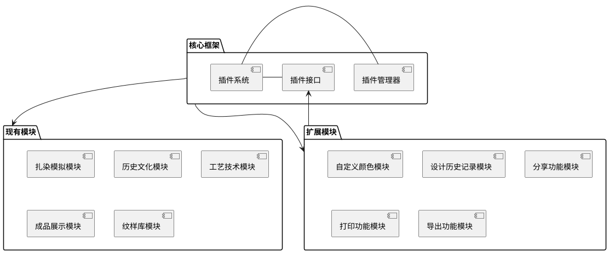

### 7.2 数据扩展接口

TieDye项目设计了灵活的数据扩展接口，支持：

1. **自定义图案格式**：通过实现`IPatternData`接口，可以添加新的图案类型
2. **新的纹理生成算法**：通过实现`ITextureGenerator`接口，可以扩展纹理生成功能
3. **自定义布料物理属性**：通过扩展`ClothPhysicsManager`类，可以添加新的物理参数
4. **新的内容类型**：通过实现`IContentData`接口，可以添加新的内容展示类型

## 8. 技术选型与依赖

| 技术/依赖 | 用途 | 版本 |
|---------|------|------|
| Unity Engine | 游戏引擎和开发平台 | 2020.3.40f1 LTS |
| C# | 主要编程语言 | 7.3 |
| DOTween | UI动画库 | 1.2.710 |
| Unity UI | 用户界面系统 | 内置 |
| Unity Physics | 物理模拟系统 | 内置 |
| Unity TextMeshPro | 高级文本渲染 | 3.0.6 |

## 9. 总结

TieDye项目采用了模块化、分层的架构设计，实现了扎染艺术的完整生态系统。通过精心设计的场景、类和交互流程，用户可以轻松地进行扎染图案设计、学习扎染历史文化、了解扎染工艺技术、浏览扎染成品和纹样。系统具有良好的扩展性，可以通过插件系统和扩展接口添加新的功能模块和数据类型。美工设计采用了传统与现代相结合的风格，使用丰富的动画效果增强用户体验。

该系统设计充分考虑了用户需求、性能要求和可扩展性，为后续的开发和维护提供了坚实的基础。