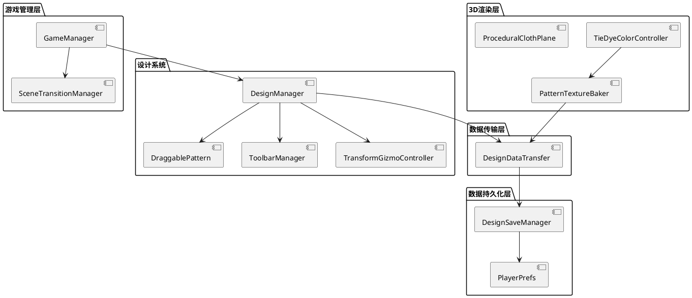
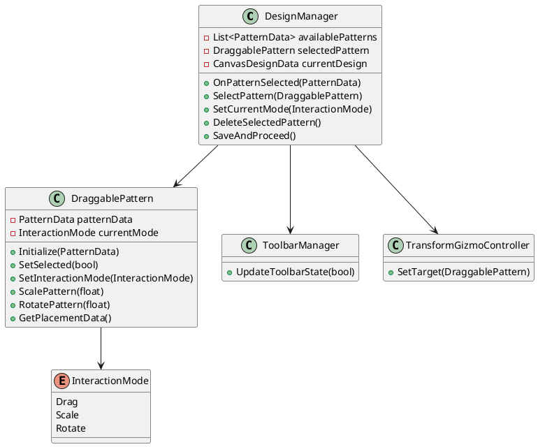
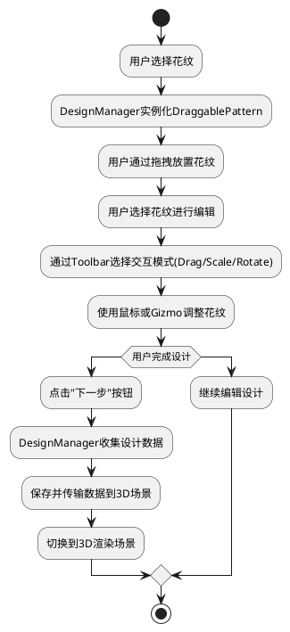
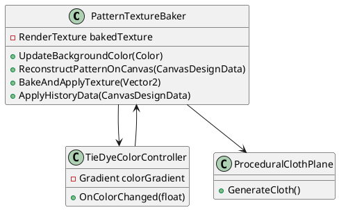
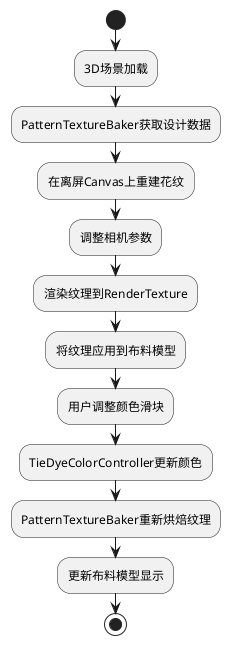
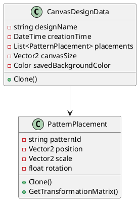
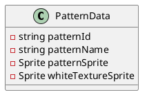
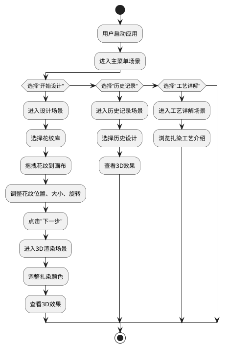
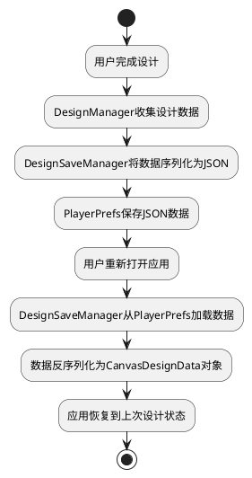

# TieDye项目系统设计报告

## 1. 系统架构设计

TieDye项目是一个基于Unity开发的扎染工艺模拟应用，采用分层架构设计，各层之间职责明确，耦合度低，便于维护和扩展。

### 1.1 整体架构图

### 1.2 架构分层说明

1. **游戏管理层**
   - 负责整个游戏的生命周期管理
   - 处理场景切换和全局状态管理
   - 提供单例模式的全局访问点

2. **设计系统**
   - 提供花纹设计的核心功能
   - 支持花纹的选择、拖拽、缩放、旋转等操作
   - 管理设计工具和交互模式

3. **3D渲染层**
   - 将2D设计转换为3D纹理
   - 实现扎染效果的渲染
   - 提供颜色控制和布料模拟

4. **数据传输层**
   - 负责场景间的数据传递
   - 确保设计数据在不同场景间的一致性

5. **数据持久化层**
   - 将设计数据保存到本地存储
   - 管理设计历史记录
   - 提供数据的加载和保存功能

## 2. 功能模块设计

### 2.1 核心功能模块

#### 2.1.1 花纹设计模块

**功能描述**：提供直观的花纹设计界面，支持用户选择、放置、调整花纹图案。

**核心类图**：

**工作流程**：

#### 2.1.2 3D渲染模块

**功能描述**：将2D设计转换为3D纹理，并应用到布料模型上，实现扎染效果的可视化。

**核心类图**：

**工作流程**：

### 2.2 数据模型

#### 2.2.1 CanvasDesignData

#### 2.2.2 PatternData

## 3. 交互设计

### 3.1 用户交互流程

### 3.2 设计场景交互

1. **花纹选择**：用户点击左侧花纹库中的花纹，自动将花纹添加到画布中央
2. **花纹拖拽**：选中花纹后，按住鼠标左键拖动可改变花纹位置
3. **花纹缩放**：通过工具栏切换到缩放模式，或使用鼠标滚轮调整花纹大小
4. **花纹旋转**：通过工具栏切换到旋转模式，或使用鼠标滚轮旋转花纹
5. **花纹删除**：选中花纹后，按Delete键或点击工具栏删除按钮
6. **Gizmo控制**：选中花纹后，可通过Gizmo直观地调整位置、旋转和缩放

### 3.3 3D场景交互

1. **颜色调整**：通过滑块控制扎染的背景颜色
2. **布料观察**：通过鼠标拖拽旋转布料，观察不同角度的效果
3. **历史记录**：可随时返回历史记录，查看之前的设计效果

## 4. 数据库设计

TieDye项目采用Unity的PlayerPrefs进行本地数据持久化，无需复杂的数据库设计。

### 4.1 数据存储结构

1. **当前设计数据**
   - 键名：`CurrentDesign`
   - 内容：CanvasDesignData对象的JSON序列化数据
   - 用途：存储用户当前的设计进度

2. **设计历史记录**
   - 键名：`DesignHistory`
   - 内容：CanvasDesignData对象列表的JSON序列化数据
   - 用途：存储用户的设计历史，最多保存10条记录

### 4.2 数据操作流程

## 5. 系统特点与优势

1. **直观的设计界面**：提供所见即所得的设计体验，用户可轻松创建复杂的花纹图案
2. **真实的3D效果**：将2D设计转换为3D纹理，呈现真实的扎染效果
3. **灵活的交互方式**：支持多种交互模式，满足不同用户的操作习惯
4. **数据持久化**：自动保存设计进度和历史记录，用户可随时继续设计
5. **可扩展性**：模块化设计便于添加新的花纹、颜色和功能

## 6. 技术选型

- **游戏引擎**：Unity 3D
- **开发语言**：C#
- **UI系统**：Unity UGUI
- **数据存储**：PlayerPrefs
- **动画系统**：DOTween

## 7. 总结

TieDye项目采用了分层架构设计，实现了花纹设计、3D渲染、数据传输和持久化等核心功能。系统交互友好，功能完善，为用户提供了一个直观、有趣的扎染工艺模拟体验。通过模块化设计和低耦合的架构，项目具有良好的可维护性和可扩展性，便于未来添加新的功能和优化现有功能。