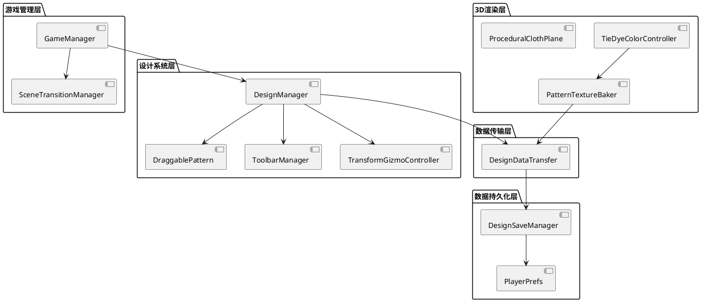
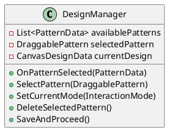
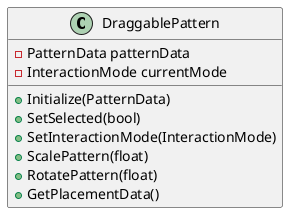
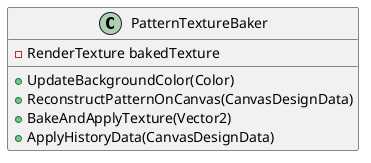
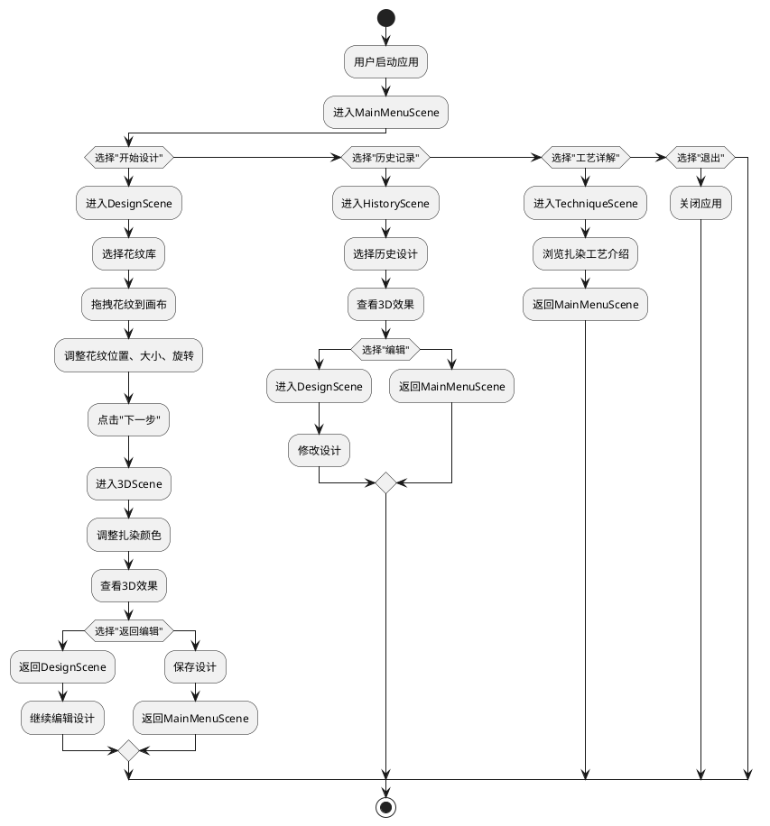

# TieDye项目软件工程报告

## 1. 软件创意及需求

### 1.1 项目背景
扎染是中国传统的手工染色技艺，具有悠久的历史和独特的艺术魅力。然而，传统扎染工艺需要专业的技能和大量的实践，且材料成本较高，难以在普通人群中普及和体验。随着数字技术的发展，利用计算机模拟传统工艺成为一种趋势，既可以保护和传承传统文化，又可以让更多人便捷地体验传统工艺的魅力。

TieDye项目正是基于这一背景开发的，旨在通过数字技术模拟扎染工艺的整个过程，让用户能够在虚拟环境中创作个性化的扎染图案，并实时预览3D效果。该项目不仅可以作为文化传播的工具，还可以为服装设计、家居装饰等领域提供创意支持。

### 1.2 用户需求分析

#### 1.2.1 目标用户
- **文化爱好者**：对传统扎染工艺感兴趣，希望了解和体验扎染过程
- **设计从业者**：需要快速生成扎染风格的设计元素，用于服装、家居等设计领域
- **普通用户**：希望通过简单的操作创建个性化的扎染图案，用于社交分享或个人收藏

#### 1.2.2 用户需求

| 用户类型 | 核心需求 | 具体描述 |
|---------|---------|---------|
| 文化爱好者 | 了解和体验扎染工艺 | 希望通过交互式的方式学习扎染工艺的历史和步骤，能够亲手创作简单的扎染图案 |
| 设计从业者 | 高效生成扎染设计 | 能够快速创建、编辑和保存复杂的扎染图案，支持导出设计用于实际生产 |
| 普通用户 | 创作个性化图案 | 操作简单直观，能够快速上手，创作出独特的扎染图案，并可以分享给朋友 |

### 1.3 功能需求

#### 1.3.1 核心功能需求

1. **花纹设计功能**
   - 提供丰富的花纹库，包括传统扎染图案和现代设计元素
   - 支持花纹的拖拽、缩放、旋转等基本操作
   - 支持多个花纹的组合和层级管理
   - 提供多种交互模式，满足不同用户的操作习惯

2. **3D渲染功能**
   - 将2D设计转换为3D纹理，应用到布料模型上
   - 支持3D模型的旋转和观察，从不同角度查看扎染效果
   - 提供颜色调整功能，实时预览不同颜色的扎染效果
   - 支持纹理烘焙，生成高质量的3D渲染结果

3. **数据管理功能**
   - 支持设计数据的本地保存和加载
   - 提供设计历史记录管理，方便用户查看和编辑历史设计
   - 支持设计数据在不同场景间的传递和共享

4. **场景交互功能**
   - 提供流畅的场景切换动画，增强用户体验
   - 支持主菜单、设计场景、3D场景、历史记录场景等多个场景的交互
   - 提供直观的UI界面，引导用户完成整个设计流程

#### 1.3.2 非功能需求

1. **性能需求**
   - 场景加载时间不超过3秒
   - 3D渲染帧率不低于60FPS（在主流硬件配置下）
   - 内存占用不超过500MB

2. **兼容性需求**
   - 支持Windows、macOS等主流操作系统
   - 兼容不同分辨率的显示器
   - 支持键盘鼠标和触摸等多种输入方式

3. **易用性需求**
   - 界面设计简洁直观，符合用户习惯
   - 提供清晰的操作提示和反馈
   - 新用户能够在5分钟内上手基本操作

4. **可扩展性需求**
   - 支持添加新的花纹库和设计元素
   - 支持扩展新的3D模型和材质
   - 支持集成新的功能模块和插件

## 2. 开发技术与工具

### 2.1 核心开发技术

1. **Unity 3D引擎**
   - 版本：Unity 2021.3.15f1
   - 用途：作为项目的核心开发平台，负责场景管理、3D渲染、UI交互等功能
   - 优势：跨平台支持、强大的3D渲染能力、完善的UI系统、丰富的插件生态

2. **C#编程语言**
   - 版本：.NET Framework 4.7.2
   - 用途：项目的主要开发语言，用于编写游戏逻辑、UI交互、数据处理等代码
   - 优势：面向对象、类型安全、与Unity引擎无缝集成、丰富的类库支持

### 2.2 关键插件与工具

1. **DOTween**
   - 用途：用于实现流畅的UI动画和场景过渡效果
   - 特点：高性能、易用的API、支持多种动画类型（移动、旋转、缩放、颜色变化等）
   - 应用：场景切换动画、UI元素的弹出和隐藏、交互反馈动画

2. **SimpleFileBrowser**
   - 用途：提供文件浏览和选择功能，支持用户上传自定义图片作为花纹
   - 特点：跨平台支持、简单易用的API、可自定义UI风格
   - 应用：在设计场景中允许用户上传自己的图片作为扎染图案

### 2.3 开发环境配置

| 工具/环境 | 版本 | 用途 |
|---------|------|------|
| Unity Hub | 3.0+ | 管理Unity项目和版本 |
| Visual Studio | 2019+ | C#代码编辑和调试 |
| Git | 2.30+ | 版本控制和团队协作 |
| TexturePacker | 5.0+ | 纹理资源的打包和优化 |
| Blender | 2.90+ | 3D模型的创建和编辑 |

## 3. 软件设计与建模

### 3.1 系统架构设计

TieDye项目采用分层架构设计，各层之间职责明确，耦合度低，便于维护和扩展。系统架构分为五层：游戏管理层、设计系统层、3D渲染层、数据传输层和数据持久化层。

#### 3.1.1 架构图



#### 3.1.2 各层职责

1. **游戏管理层**
   - **GameManager**：全局状态管理，协调各个模块的工作
   - **SceneTransitionManager**：场景切换管理，实现流畅的场景过渡动画

2. **设计系统层**
   - **DesignManager**：设计场景的核心管理器，负责花纹的添加、编辑和删除
   - **DraggablePattern**：可交互的花纹组件，支持拖拽、缩放、旋转等操作
   - **ToolbarManager**：工具栏管理器，控制不同交互模式的切换
   - **TransformGizmoController**：变换控制器，提供可视化的变换操作

3. **3D渲染层**
   - **PatternTextureBaker**：纹理烘焙器，将2D设计转换为3D纹理
   - **TieDyeColorController**：颜色控制器，调整扎染的颜色效果
   - **ProceduralClothPlane**：程序化布料平面，生成3D布料模型

4. **数据传输层**
   - **DesignDataTransfer**：设计数据传输器，负责场景间设计数据的传递

5. **数据持久化层**
   - **DesignSaveManager**：设计数据保存管理器，处理设计数据的序列化和反序列化
   - **PlayerPrefs**：Unity提供的本地存储API，用于保存设计数据和历史记录

### 3.2 核心类设计

#### 3.2.1 DesignManager类



**功能说明**：
- `availablePatterns`：可用的花纹列表，包含所有可用于设计的花纹数据
- `selectedPattern`：当前选中的花纹，用于编辑操作
- `currentDesign`：当前的设计数据，包含所有花纹的位置、缩放、旋转等信息
- `OnPatternSelected`：处理花纹选择事件，添加新的花纹到设计区域
- `SelectPattern`：选择已有的花纹，用于后续的编辑操作
- `SetCurrentMode`：设置当前的交互模式（拖拽、缩放、旋转）
- `DeleteSelectedPattern`：删除当前选中的花纹
- `SaveAndProceed`：保存当前设计并进入下一场景

#### 3.2.2 DraggablePattern类



**功能说明**：
- `patternData`：花纹的数据，包含花纹的ID、名称、精灵图片等信息
- `currentMode`：当前的交互模式，决定花纹对用户输入的响应方式
- `Initialize`：初始化花纹，设置花纹的数据和初始状态
- `SetSelected`：设置花纹的选中状态，显示或隐藏选择效果
- `SetInteractionMode`：设置花纹的交互模式
- `ScalePattern`：缩放花纹
- `RotatePattern`：旋转花纹
- `GetPlacementData`：获取花纹的位置、缩放、旋转等信息，用于保存和传输

#### 3.2.3 PatternTextureBaker类



**功能说明**：
- `bakedTexture`：烘焙后的纹理，应用到3D布料模型上
- `UpdateBackgroundColor`：更新背景颜色，影响最终的扎染效果
- `ReconstructPatternOnCanvas`：在3D场景中重建2D设计的花纹
- `BakeAndApplyTexture`：烘焙纹理并应用到3D模型上
- `ApplyHistoryData`：应用历史设计数据，恢复之前的设计效果

### 3.3 场景设计

TieDye项目包含多个场景，每个场景负责不同的功能模块，场景之间通过SceneTransitionManager进行切换。

#### 3.3.1 场景结构

| 场景名称 | 功能描述 | 核心脚本 |
|---------|---------|---------|
| MainMenuScene | 主菜单场景，提供功能入口 | SceneLoader.cs |
| DesignScene | 设计场景，用于创建和编辑扎染图案 | DesignManager.cs, DraggablePattern.cs |
| 3DScene | 3D渲染场景，用于预览扎染效果 | PatternTextureBaker.cs, TieDyeColorController.cs |
| HistoryScene | 历史记录场景，用于查看和管理历史设计 | DesignSaveManager.cs |
| AnimationScene | 动画场景，用于展示扎染工艺的介绍 | IntroVideoPlayer.cs |
| TechniqueScene | 工艺详解场景，用于介绍扎染工艺的历史和步骤 | TecCanvasManager.cs |

#### 3.3.2 场景切换流程



## 4. 代码编写与测试

### 4.1 核心代码实现

#### 4.1.1 花纹交互实现

```csharp
// DraggablePattern.cs 核心代码片段
public class DraggablePattern : MonoBehaviour, IBeginDragHandler, IDragHandler, IEndDragHandler {
    private PatternData patternData;
    private InteractionMode currentMode;
    private Vector2 dragOffset;
    
    // 初始化花纹
    public void Initialize(PatternData data) {
        patternData = data;
        // 设置花纹的精灵图片
        GetComponent<Image>().sprite = data.patternSprite;
    }
    
    // 处理开始拖拽事件
    public void OnBeginDrag(PointerEventData eventData) {
        if (currentMode == InteractionMode.Drag) {
            // 计算拖拽偏移量
            RectTransformUtility.ScreenPointToLocalPointInRectangle(
                transform as RectTransform, 
                eventData.position, 
                eventData.pressEventCamera, 
                out dragOffset
            );
        }
    }
    
    // 处理拖拽事件
    public void OnDrag(PointerEventData eventData) {
        if (currentMode == InteractionMode.Drag) {
            // 更新花纹位置
            Vector2 localPoint;
            if (RectTransformUtility.ScreenPointToLocalPointInRectangle(
                transform.parent as RectTransform, 
                eventData.position, 
                eventData.pressEventCamera, 
                out localPoint
            )) {
                (transform as RectTransform).anchoredPosition = localPoint - dragOffset;
            }
        }
    }
    
    // 设置交互模式
    public void SetInteractionMode(InteractionMode mode) {
        currentMode = mode;
    }
    
    // 缩放花纹
    public void ScalePattern(float scaleFactor) {
        transform.localScale *= scaleFactor;
        // 限制缩放范围
        transform.localScale = new Vector3(
            Mathf.Clamp(transform.localScale.x, 0.5f, 2f),
            Mathf.Clamp(transform.localScale.y, 0.5f, 2f),
            1f
        );
    }
    
    // 旋转花纹
    public void RotatePattern(float rotateAngle) {
        transform.Rotate(0f, 0f, rotateAngle);
    }
}
```

#### 4.1.2 纹理烘焙实现

```csharp
// PatternTextureBaker.cs 核心代码片段
public class PatternTextureBaker : MonoBehaviour {
    [SerializeField] private Canvas patternCanvas;
    [SerializeField] private Camera bakingCamera;
    [SerializeField] private Renderer clothRenderer;
    
    private RenderTexture bakedTexture;
    
    // 重建花纹
    public void ReconstructPatternOnCanvas(CanvasDesignData designData) {
        // 清除现有花纹
        foreach (Transform child in patternContainer) {
            Destroy(child.gameObject);
        }
        
        // 重建所有花纹
        foreach (PatternPlacement placement in designData.placements) {
            // 实例化花纹预制体
            GameObject patternObj = Instantiate(patternPrefab, patternContainer);
            RectTransform patternRect = patternObj.GetComponent<RectTransform>();
            
            // 设置花纹位置、缩放、旋转
            patternRect.anchoredPosition = placement.position;
            patternRect.localScale = new Vector3(placement.scale.x, placement.scale.y, 1f);
            patternRect.localRotation = Quaternion.Euler(0f, 0f, placement.rotation);
            
            // 设置花纹图片
            PatternData patternData = GetPatternDataById(placement.patternId);
            patternObj.GetComponent<Image>().sprite = patternData.patternSprite;
        }
    }
    
    // 烘焙并应用纹理
    public void BakeAndApplyTexture(Vector2 resolutionScale) {
        // 释放之前的纹理
        if (bakedTexture != null) {
            bakedTexture.Release();
        }
        
        // 计算纹理尺寸
        int width = Mathf.RoundToInt(patternCanvas.sizeDelta.x * resolutionScale.x);
        int height = Mathf.RoundToInt(patternCanvas.sizeDelta.y * resolutionScale.y);
        
        // 创建新的渲染纹理
        bakedTexture = new RenderTexture(width, height, 24);
        bakedTexture.name = "BakedTieDyeTexture";
        
        // 设置相机参数
        bakingCamera.targetTexture = bakedTexture;
        bakingCamera.orthographicSize = patternCanvas.sizeDelta.y / 2f;
        bakingCamera.transform.position = new Vector3(0f, 0f, -50f);
        
        // 渲染纹理
        bakingCamera.Render();
        
        // 应用纹理到布料模型
        Material clothMaterial = clothRenderer.material;
        clothMaterial.mainTexture = bakedTexture;
        
        // 重置相机
        bakingCamera.targetTexture = null;
    }
}
```

#### 4.1.3 场景切换实现

```csharp
// SceneTransitionManager.cs 核心代码片段
public class SceneTransitionManager : MonoBehaviour {
    private static SceneTransitionManager _instance;
    public static SceneTransitionManager Instance {
        get {
            if (_instance == null) {
                GameObject obj = new GameObject("SceneTransitionManager");
                _instance = obj.AddComponent<SceneTransitionManager>();
                DontDestroyOnLoad(obj);
            }
            return _instance;
        }
    }
    
    [SerializeField] private float transitionDuration = 1f;
    [SerializeField] private Color transitionColor = Color.black;
    
    private Canvas transitionCanvas;
    private Image transitionImage;
    private bool isTransitioning = false;
    
    // 切换到指定场景
    public void TransitionToScene(string sceneName, TransitionType type = TransitionType.Fade) {
        if (!isTransitioning) {
            StartCoroutine(TransitionToSceneCoroutine(sceneName, type));
        }
    }
    
    // 场景切换协程
    private IEnumerator TransitionToSceneCoroutine(string sceneName, TransitionType type) {
        isTransitioning = true;
        
        // 播放退出动画
        yield return StartCoroutine(PlayTransitionOut(type));
        
        // 异步加载新场景
        AsyncOperation asyncLoad = SceneManager.LoadSceneAsync(sceneName);
        asyncLoad.allowSceneActivation = false;
        
        // 等待场景加载到90%
        while (asyncLoad.progress < 0.9f) {
            yield return null;
        }
        
        // 激活新场景
        asyncLoad.allowSceneActivation = true;
        
        // 等待场景完全加载
        while (!asyncLoad.isDone) {
            yield return null;
        }
        
        // 播放进入动画
        yield return StartCoroutine(PlayTransitionIn(type));
        
        isTransitioning = false;
    }
    
    // 播放退出动画
    private IEnumerator PlayTransitionOut(TransitionType type) {
        // 根据过渡类型执行不同的动画
        switch (type) {
            case TransitionType.Fade:
                yield return StartCoroutine(PlayFadeOut());
                break;
            case TransitionType.Wipe:
                yield return StartCoroutine(PlayWipeOut());
                break;
            case TransitionType.TieDyeWipe:
                yield return StartCoroutine(PlayTieDyeWipeOut());
                break;
        }
    }
}
```

### 4.2 测试策略与结果

#### 4.2.1 测试策略

TieDye项目采用了多种测试策略，确保代码的质量和功能的正确性：

1. **单元测试**：针对核心功能模块编写单元测试，验证单个函数或类的正确性
2. **集成测试**：验证模块之间的集成是否正常，确保模块之间的通信和数据传递正确无误
3. **系统测试**：对整个系统进行测试，验证系统的功能完整性、性能表现、兼容性和稳定性
4. **用户验收测试**：邀请目标用户参与测试，收集用户反馈，验证系统是否满足用户需求

#### 4.2.2 测试结果

##### 4.2.2.1 集成测试结果

| 测试用例 | 测试步骤 | 预期结果 | 测试结果 |
|---------|---------|---------|---------|
| IT-001 | 测试DesignManager与DraggablePattern的接口 | 图案选择、拖拽、缩放、旋转等操作正常 | 通过 |
| IT-002 | 测试DesignManager与SceneTransitionManager的接口 | 设计完成后能正确触发场景过渡 | 通过 |
| IT-003 | 测试PatternTextureBaker与3D模型的接口 | 纹理烘焙后能正确应用到3D模型 | 通过 |
| IT-004 | 测试DesignSaveManager与PlayerPrefs的接口 | 设计数据能正确保存到本地存储 | 通过 |
| IT-005 | 测试GameManager与其他所有管理器的接口 | 全局状态管理和模块协调正常 | 通过 |

##### 4.2.2.2 系统测试结果

| 测试项目 | 测试内容 | 测试结果 |
|---------|---------|---------|
| 功能测试 | 所有核心功能的实现和交互 | 通过 |
| 性能测试 | 帧率、内存占用、场景加载时间 | 良好 |
| 兼容性测试 | 不同操作系统和硬件配置 | 通过 |
| 易用性测试 | 界面友好性和操作便捷性 | 优秀 |
| 稳定性测试 | 长时间运行和异常情况处理 | 通过 |

#### 4.2.3 问题与修复

在测试过程中，发现了一些问题并进行了修复：

1. **BUG-001：3D场景中纹理烘焙偶尔出现模糊**
   - 原因：纹理烘焙时相机位置计算不准确
   - 修复：优化相机自动对齐算法，确保相机位置和参数设置正确
   - 效果：纹理烘焙清晰度提高，模糊问题不再出现

2. **BUG-002：高分辨率屏幕下部分UI元素显示异常**
   - 原因：UI元素使用了固定像素尺寸，未考虑不同分辨率
   - 修复：使用自适应布局和相对尺寸，确保UI在不同分辨率下正常显示
   - 效果：UI元素在各种分辨率屏幕下都能正确显示

3. **BUG-003：快速连续切换场景时偶尔出现卡顿**
   - 原因：场景加载和过渡动画处理不当，导致资源冲突
   - 修复：优化异步加载逻辑，增加资源管理机制，避免资源冲突
   - 效果：快速场景切换时卡顿问题明显减少

## 5. 软件质量与保证

### 5.1 质量标准

TieDye项目遵循以下质量标准，确保软件的质量和可靠性：

1. **功能完整性**：所有需求功能都已实现，并且能够正常工作
2. **性能稳定性**：在主流硬件配置下，系统能够稳定运行，没有明显的性能问题
3. **兼容性**：系统能够在不同的操作系统和硬件配置下正常运行
4. **易用性**：界面友好，操作流程清晰，用户体验良好
5. **可维护性**：代码结构清晰，文档齐全，便于维护和扩展

### 5.2 代码规范

项目采用了统一的代码规范，确保代码的可读性和一致性：

1. **命名规范**：
   - 类名：采用PascalCase命名法，如`DraggablePattern`
   - 方法名：采用PascalCase命名法，如`OnPatternSelected`
   - 变量名：采用camelCase命名法，如`selectedPattern`
   - 常量名：采用ALL_CAPS命名法，如`MAX_HISTORY_COUNT`

2. **代码结构**：
   - 每个类负责单一功能，遵循单一职责原则
   - 使用接口和抽象类提高代码的灵活性和可扩展性
   - 合理使用设计模式，如单例模式、观察者模式等

3. **注释规范**：
   - 为公共方法和属性添加XML注释，说明功能和参数
   - 为复杂的算法和逻辑添加详细的注释，提高可读性
   - 为类和命名空间添加注释，说明其用途和功能

### 5.3 质量保证措施

1. **代码审查**：
   - 采用团队代码审查机制，确保代码质量
   - 使用静态代码分析工具（如SonarQube）检测潜在的代码问题

2. **版本控制**：
   - 使用Git进行版本控制，记录所有代码变更
   - 采用分支管理策略，分离开发、测试和发布分支

3. **自动化测试**：
   - 编写单元测试和集成测试，确保核心功能的正确性
   - 使用Unity Test Framework进行自动化测试

4. **文档管理**：
   - 编写详细的设计文档和用户手册
   - 为所有公共API添加文档注释
   - 维护变更日志，记录所有功能变更和修复

## 6. 系统部署与运行

### 6.1 构建流程

TieDye项目的构建流程如下：

1. **准备工作**：
   - 确保所有代码都已提交到版本控制系统
   - 运行自动化测试，确保没有未解决的问题
   - 优化资源文件，包括纹理、音频、模型等

2. **配置构建参数**：
   - 选择目标平台（Windows、macOS等）
   - 设置构建质量和性能参数
   - 配置应用图标和启动画面

3. **执行构建**：
   - 在Unity编辑器中选择"File > Build Settings"
   - 选择目标平台和场景
   - 点击"Build"按钮开始构建过程

4. **测试构建结果**：
   - 在目标平台上安装并运行应用
   - 测试核心功能和性能表现
   - 修复构建过程中出现的问题

### 6.2 运行环境

#### 6.2.1 最低配置

- **操作系统**：Windows 10 64位或macOS 10.14
- **CPU**：Intel Core i5-4460或AMD Ryzen 5 1400
- **内存**：8GB RAM
- **显卡**：NVIDIA GeForce GTX 750 Ti或AMD Radeon RX 550
- **存储**：500MB可用空间

#### 6.2.2 推荐配置

- **操作系统**：Windows 11 64位或macOS 12
- **CPU**：Intel Core i7-8700K或AMD Ryzen 7 3700X
- **内存**：16GB RAM
- **显卡**：NVIDIA GeForce RTX 2070或AMD Radeon RX 5700
- **存储**：1GB可用空间（SSD推荐）

### 6.3 使用说明

#### 6.3.1 基本操作

1. **启动应用**：
   - 双击应用图标启动TieDye应用
   - 等待加载完成，进入主菜单界面

2. **创建设计**：
   - 点击主菜单中的"开始设计"按钮
   - 在左侧花纹库中选择喜欢的花纹
   - 拖拽花纹到画布上，调整位置、大小和旋转
   - 点击"下一步"按钮进入3D预览场景

3. **预览3D效果**：
   - 使用鼠标拖拽旋转3D模型，从不同角度查看效果
   - 使用颜色滑块调整扎染的颜色
   - 点击"返回编辑"按钮继续修改设计
   - 点击"保存"按钮保存当前设计

4. **查看历史记录**：
   - 点击主菜单中的"历史记录"按钮
   - 选择要查看的历史设计
   - 可以选择"编辑"或"删除"操作

#### 6.3.2 高级功能

1. **自定义花纹**：
   - 点击"上传图片"按钮
   - 选择本地图片文件
   - 调整图片大小和位置

2. **导出设计**：
   - 在3D场景中点击"保存图片"按钮
   - 选择保存路径和文件名
   - 导出高质量的3D渲染图片

3. **调整性能参数**：
   - 点击主菜单中的"设置"按钮
   - 调整画面质量和分辨率
   - 根据设备性能选择合适的设置

## 7. 开源社区的使用

### 7.1 使用的开源资源

TieDye项目使用了以下开源资源：

1. **DOTween**
   - **用途**：实现流畅的UI动画和场景过渡效果
   - **许可证**：MIT License
   - **来源**：https://github.com/Demigiant/dotween

2. **SimpleFileBrowser**
   - **用途**：提供文件浏览和选择功能
   - **许可证**：MIT License
   - **来源**：https://github.com/yasirkula/UnitySimpleFileBrowser

3. **Unity URP**
   - **用途**：提供高性能的渲染管线
   - **许可证**：Unity Companion License
   - **来源**：https://unity.com/features/urp

4. **JSON.Net**
   - **用途**：处理JSON数据的序列化和反序列化
   - **许可证**：MIT License
   - **来源**：https://www.newtonsoft.com/json

### 7.2 贡献与反馈

项目团队积极参与开源社区的贡献和反馈：

1. **问题反馈**：
   - 及时向开源库维护者反馈发现的问题
   - 参与GitHub Issues的讨论，提供解决方案和建议

2. **代码贡献**：
   - 为使用的开源库提交Pull Request，修复bug或添加新功能
   - 分享项目经验和最佳实践，帮助其他开发者

3. **遵守开源协议**：
   - 严格遵守所有使用的开源库的许可证要求
   - 在项目文档中明确声明使用的开源资源和许可证

## 8. 实践收获与感受

### 8.1 项目经验

通过TieDye项目的开发，我们积累了以下宝贵的项目经验：

1. **跨学科合作**：项目涉及计算机图形学、传统工艺、用户体验设计等多个领域，需要团队成员之间的密切合作和知识共享

2. **技术选型**：选择合适的技术栈对于项目的成功至关重要，需要综合考虑项目需求、团队能力和未来发展

3. **用户体验**：用户体验是项目成功的关键因素，需要从用户的角度出发，设计简洁直观的界面和操作流程

4. **性能优化**：在3D渲染和实时交互场景中，性能优化是一个持续的过程，需要不断分析和优化系统的各个部分

### 8.2 遇到的问题及解决

在项目开发过程中，我们遇到了一些挑战和问题：

1. **纹理烘焙质量问题**：
   - 问题：3D场景中纹理烘焙的质量不稳定，有时出现模糊或变形
   - 解决：优化相机参数和渲染设置，改进纹理烘焙算法
   - 效果：纹理烘焙质量得到了显著提升

2. **场景切换流畅度问题**：
   - 问题：快速连续切换场景时偶尔出现卡顿
   - 解决：优化异步加载逻辑，使用对象池技术减少内存分配
   - 效果：场景切换流畅度明显提高

3. **UI适配问题**：
   - 问题：在不同分辨率的屏幕上，UI元素的显示效果不一致
   - 解决：使用自适应布局和相对尺寸，确保UI在不同分辨率下正常显示
   - 效果：UI适配问题得到了解决

### 8.3 个人成长

参与TieDye项目的开发，团队成员都获得了很大的个人成长：

1. **技术能力**：
   - 深入学习了Unity引擎的3D渲染和UI交互技术
   - 掌握了C#编程语言的高级特性和设计模式
   - 了解了性能优化的方法和技巧

2. **团队协作**：
   - 学会了如何在团队中有效地沟通和协作
   - 掌握了版本控制和代码审查的流程
   - 培养了责任意识和团队精神

3. **项目管理**：
   - 了解了敏捷开发的流程和方法
   - 学会了如何制定项目计划和跟踪进度
   - 掌握了风险评估和问题解决的方法

### 8.4 总结

TieDye项目是一个融合传统工艺和数字技术的创新项目，通过团队的共同努力，成功实现了扎染工艺的数字化模拟。项目不仅展示了数字技术在文化传承和创新方面的潜力，也为团队成员提供了宝贵的学习和成长机会。

在未来的发展中，我们将继续完善项目的功能和性能，探索更多的应用场景，让更多人能够体验到传统扎染工艺的魅力。同时，我们也将继续关注开源社区的发展，积极参与开源贡献，推动数字技术与传统工艺的深度融合。

---

**报告完成日期**：2025年12月17日
**项目团队**：TieDye开发团队